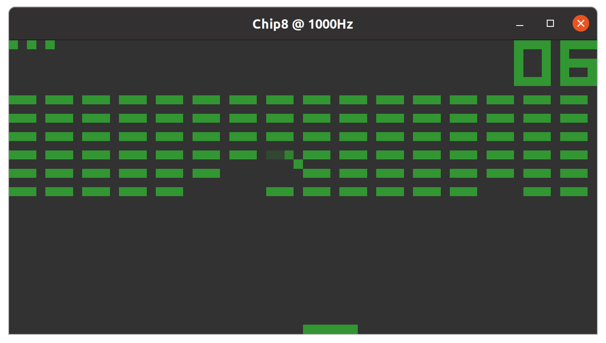

# CHIP-8 Interpreter
Yet another Chip-8 interpreter. Library and demo Swing application written in Kotlin.

Supports CHIP-8, Superchip 1.1 and XO-Chip instructions.

The keys valid during emulation are 1234 QWER ASDF ZXCV. Arrow keys are mapped to WASD.

Function keys:

- F1 - Resets current ROM
- F2 - Loads ROM file
- F3 - Disables persistence
- F4 - Normal persistence (disabled with XO-Chip color planes)
- F5 - Long persistence (disabled with XO-Chip color planes)
- F10 - Divides the current CPU speed by 2
- F11 - Sets virtual CPU as 1Khz
- F12 - Multiplies the current CPU speed by 2
